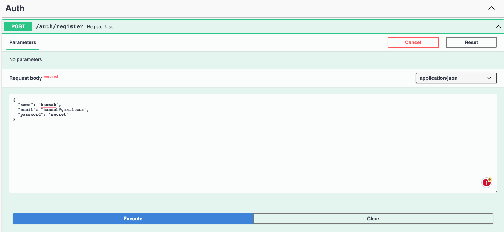
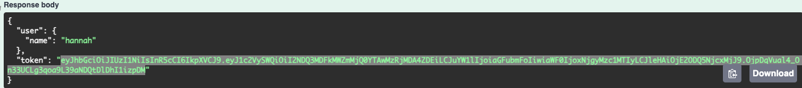
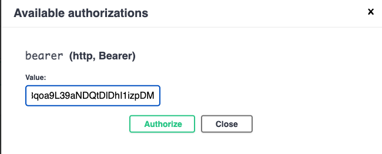
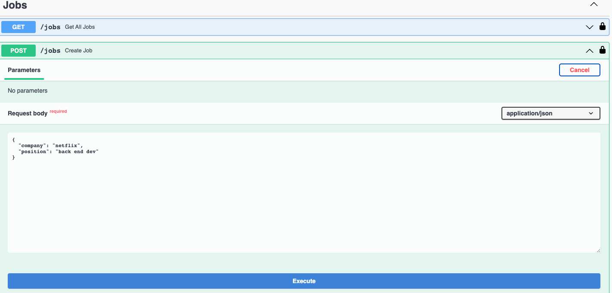
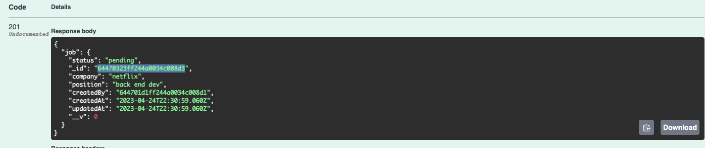
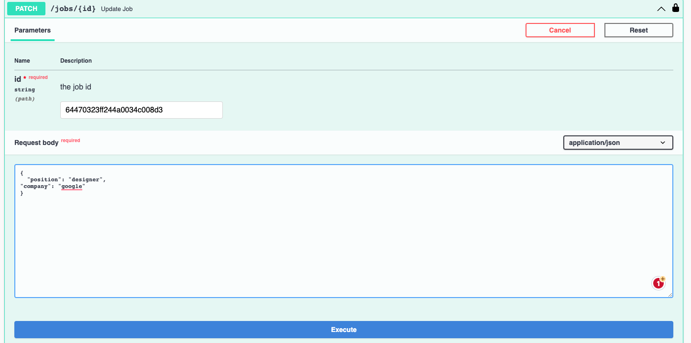

# jobs-api

[CLICK HERE FOR DEPLOYED APP](https://jobs-api-v8bo.onrender.com/)

## Summary

This express project required extensive use of MVC-architecture, REST APIs, and javascript to create a web app that allows users to create jobs in a database. Users have the ability to create an account, then perform CRUD operations on every job they create.

This project also heavily emphasized using best practices for securing user data. For example, every User object was created by using MongoDB instances, bcryptjs, and JSON Web Tokens to ensure that users' passwords can never be accessed.

This project also utilized middleware, protected routes, and extensive custom-error handling.

## About Deployment and Frontend

This application was deployed on Render. It uses APIMATIC and SwaggerUI for the front-end architecture.

## How to Use

1. Go to the deployed app by clicking the link above or navigate to https://jobs-api-v8bo.onrender.com/

2. Register a new user

   1. click the register user endpoint
   2. click try it out
   3. add in a custom name, email, or password. If the email is already used, then you will get an error.
   4. click execute
   5. just below the execute button you will see box detailing the server response
   6. copy the value inside of the token property. Make sure that you do not include the quotation marks.

3. Navigate to the top of the page and click the Authorize button

   1. Paste in the token you copied earlier
   2. Click Authorize
   3. Click close

4. Now you are ready to access every route in the application

5. Add a job to the database

   1. Navigate down to the Jobs section.
   2. Find the Create Job endpoint.
   3. Click the green box.
   4. Click the Try it Out button
   5. Change the values for either company or position. For example, change "netflix" or "back end dev" to what you want.
   6. Click execute

6. View the jobs that are in the database

   1. Navigate to Get All Jobs route
   2. Click Try it out button
   3. Click execute button
   4. View your results
   5. Copy the value inside the quotation marks for the "\_id" property

7. Update a Job

   1. From step 6, copy the value inside the quotation marks for the "\_id" property.
   2. Click try it out button
   3. Paste in the id
   4. change the value of "position" or "company" properties
   5. View the response body to see that the company and/or position properties have been changed for that unique job id

8. Get a single Job

   1. Similar to step 7

9. Delete a Job
   1. Similar to step 7
